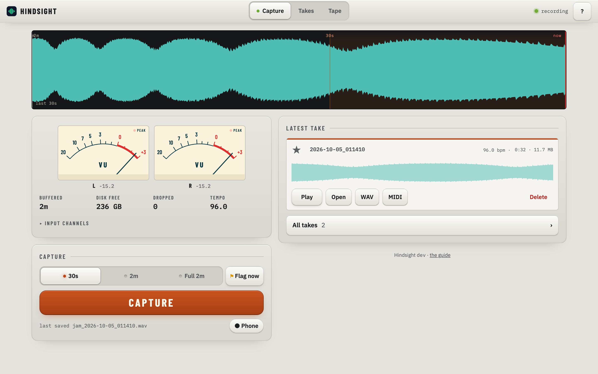
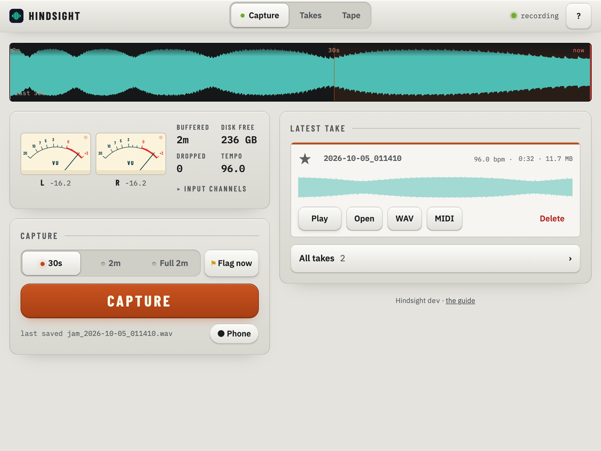
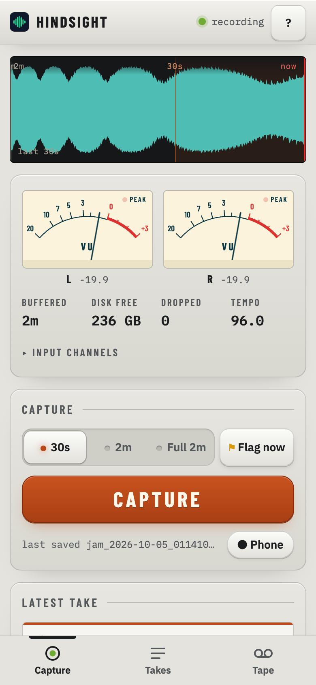

# Hindsight

An always-listening audio buffer for a Raspberry Pi.

It captures a USB audio interface into a memory ring, continuously. Pressing
**Capture** in the web UI writes the last 30 seconds, 2 minutes, 7 minutes or
the whole ring to disk. Nothing touches disk until you ask.

It exists because the take you want is the one you already played.



## Features

- **Take page** — open any take to zoom and scrub it: drag to move along, press and hold then drag to select a part, set In and Out at the playhead, loop it, snap to the bar grid, flag moments, share the selection as an MP3 from your phone, or save it as a new take with declick fades. Every control explains itself in help mode (**?**), and [the guide](docs/guide.md) is served by the app at `/guide.html`.
- **Rising notes** — press Play and the take's MIDI plays out on a keyboard: every note grows out of its key and rises away, drums pop out of their pads. On a tablet it fills the right of the take page beside the wave and lanes; on a phone it opens from the Notes button in the header. Chips mute a track in the view, and the speed chip plays the preview at ½× or 2× with the pitch kept.
- **Record from your phone** — the Phone button records the phone's mic, or an instrument plugged into it, straight into the takes list from anywhere in the house. It streams to the Pi as you play and survives Wi-Fi dropouts; it needs the Pi's HTTPS address, since browsers only open the mic on a secure page.
- **Tape** *(in progress; `TAPE=true`)* — an OP-1-style four-track. Send a take's loop to tape, then catch what you play over it — the last pass, or the last few bars — onto the next track, after you've played it; lift, drop, split, slide and double bars the OP-1 way; mix it down to a take, or export stems. It can lead the Bento's clock. It plays through the Sidekick and lines itself up with the recording by listening to itself. See [the guide, §8](docs/guide.md#8-tape).
- **MIDI beside every take** — every USB MIDI device that enumerates is read, and a save writes a Standard MIDI File next to the WAV: one track per device and channel, on the take's timeline to within a couple of milliseconds, with a tempo map from the clock so the notes land on the DAW grid. Drop both at the project start and they line up.

## Try it

The demo runs the whole application — UI, meters, buffer ribbon, capture,
takes — against a synthetic 96 BPM loop. No audio interface, no PortAudio, no
cgo. Go 1.23 or newer is the only requirement.

```bash
git clone https://github.com/gabeduke/hindsight && cd hindsight
RING_SECONDS=120 CGO_ENABLED=0 go run ./cmd/hindsight --demo
```

Then open <http://127.0.0.1:5000>.

`CGO_ENABLED=0` is what makes that true. Without it Go links the real PortAudio
binding, which needs the C library present — so on a machine that does not have
it the build fails before the demo ever starts.

`RING_SECONDS=120` deliberately shrinks the ring for the demo. The default is
the Pi-sized `900`, which allocates about 1.4 GB up front and takes fifteen
real minutes to fill — so the buffer ribbon would sit almost empty for the
whole time you were looking at it.

**On macOS, port 5000 is usually taken** by ControlCenter's AirPlay Receiver,
and you get `http: listen tcp :5000: bind: address already in use`. Pick
another port:

```bash
RING_SECONDS=120 PORT=5173 CGO_ENABLED=0 go run ./cmd/hindsight --demo
```

Takes are written to `~/hindsight/jam_saves` unless you set `OUTPUT_DIR`. If
`ffmpeg` is not on your `PATH` the audio still saves, but the takes list has no
mp3 preview to play or draw.

## Install on a Raspberry Pi

Every merge to `main` publishes an arm64 tarball. Download it, check it,
unpack it, run the installer. (These URLs resolve once the repository is
renamed to `hindsight`; until then, use the current repository's releases
page.)

```bash
curl -fsSLO https://github.com/gabeduke/hindsight/releases/latest/download/SHA256SUMS
tarball=$(awk '{print $2}' SHA256SUMS)
curl -fsSLO "https://github.com/gabeduke/hindsight/releases/latest/download/$tarball"
sha256sum -c SHA256SUMS
tar xzf "$tarball"
cd "${tarball%.tar.gz}"
./install.sh
```

The installer adds the runtime packages, puts the binary and UI under
`~/hindsight`, installs a systemd **user** service and enables lingering so it
keeps running after you log out. It has not yet been run end to end on a real
Pi — [docs/install-raspberry-pi.md](docs/install-raspberry-pi.md) walks through
it and says what to check.

## Hardware

- A Raspberry Pi 5. 8 GB if you want the default 15-minute ring; the buffer is
  uncompressed and lives in RAM.
- A USB audio interface whose master output lands on a known channel pair.

Developed against a Teenage Engineering EP-136, but nothing here is specific to
it: anything PortAudio enumerates should work. The two knobs are `DEVICE_MATCH`
(a substring of the device name) and `SAVE_CHANNELS` (which pair is the
master).

If the interface also sends MIDI clock, Hindsight reads it and stamps each take
with the tempo it measured. That is a starting point you can edit, not a fact.
Any other class-compliant USB MIDI device plugged into the Pi is read too, and
what it sent during a take is written beside the take as a `.mid`.

## How it works

```
USB audio interface (8ch)
   │  PortAudio callback — computes level bins, hands blocks off, never blocks
   ▼
free/filled block pool ──► ring writer goroutine ──► Ring (RING_SECONDS)
   │                                                   │
   │ Levels (10ms min/max/RMS bins)                    │ Snapshot(seconds)
   ▼                                                   ▼
WebSocket /api/live ──► level meters              WAV ─┬─► mp3 preview
/api/envelope ──► buffer ribbon                        ├─► .peaks.json + .peaks.bin
                                                       └─► .meta.json (label, flags, tempo)
```

The audio callback only computes levels and hands the block to a pooled
channel. A single writer goroutine owns the ring, so a capture can memcpy a
snapshot out under a mutex without ever stalling the device.

The levels also feed an envelope of the whole ring, which is what the buffer
ribbon across the top of the page draws. Its time axis is logarithmic, so the
recent end is legible and the old end still fits: you can see where in the last
fifteen minutes something was happening before deciding how much to keep.

More in [docs/architecture.md](docs/architecture.md).

## Configuration

Everything is environment driven. Copy `deploy/hindsight.env.example` to
`~/hindsight/hindsight.env`; the four most people touch are:

| Variable | Default | Notes |
|---|---|---|
| `RING_SECONDS` | `900` | Buffer length, and the longest possible capture. Dominates RAM: `seconds × 48000 × channels × 4` bytes |
| `SAVE_CHANNELS` | `1,2` | 1-indexed pair carrying the stereo master |
| `DEVICE_MATCH` | `EP-136` | Substring match on the PortAudio device name |
| `MAX_SAVES` | `0` | Move the oldest takes beyond this count to the trash; `0` disables |
| `MIDI_CLOCK_DEVICE` | *(`DEVICE_MATCH`)* | Which device's MIDI clock is the tempo for the `.mid`'s grid |

Every variable, with the reasoning behind the defaults, is in
[docs/configuration.md](docs/configuration.md).

## On a phone




The UI is built for a tablet propped next to the gear, and works down to a
phone. On **iOS**, Share → Add to Home Screen gives a real standalone app over
plain HTTP. **Android** will only offer a full install over HTTPS — as will
service workers, which do not register in an insecure context at all. The
install guide covers putting the Pi on an HTTPS name with `tailscale serve`,
which is also what lets the Phone button record.

## Documentation

| | |
|---|---|
| [docs/guide.md](docs/guide.md) | How to use it, in plain words: what the words mean (§2), and the checks each feature must pass |
| [docs/install-raspberry-pi.md](docs/install-raspberry-pi.md) | Getting it running on a Pi, and operating it afterwards |
| [docs/configuration.md](docs/configuration.md) | Every environment variable, and why the defaults are what they are |
| [docs/api.md](docs/api.md) | The HTTP API |
| [docs/architecture.md](docs/architecture.md) | How the capture path is put together, and the traps it avoids |
| [docs/development.md](docs/development.md) | Building, testing, deploying, and the hardware probes |

Release history is in [CHANGELOG.md](CHANGELOG.md).

## License

MIT. See [LICENSE](LICENSE).
