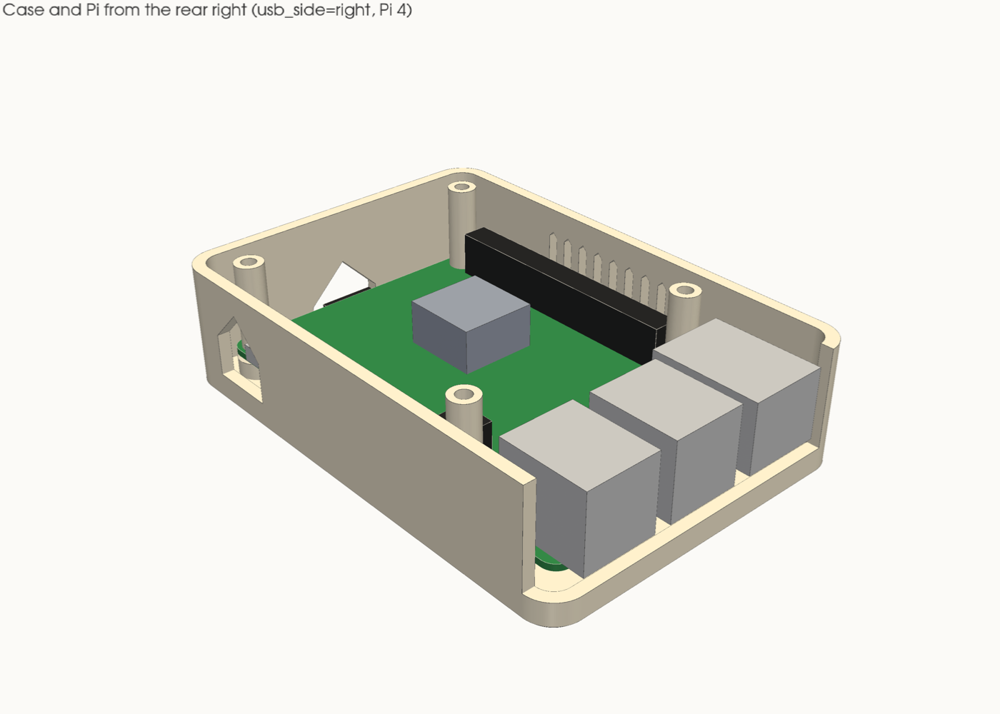
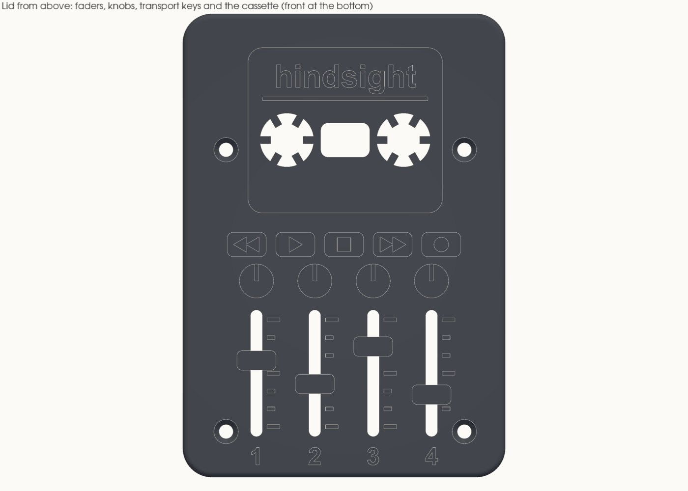
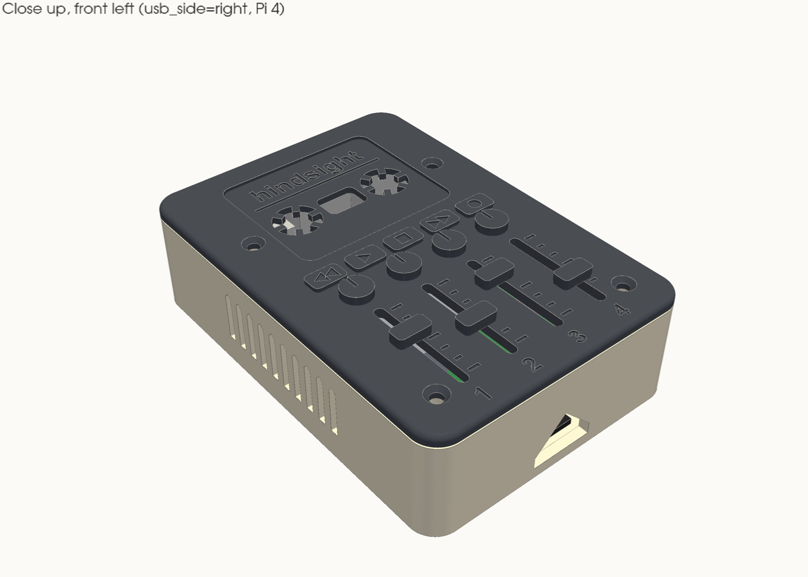
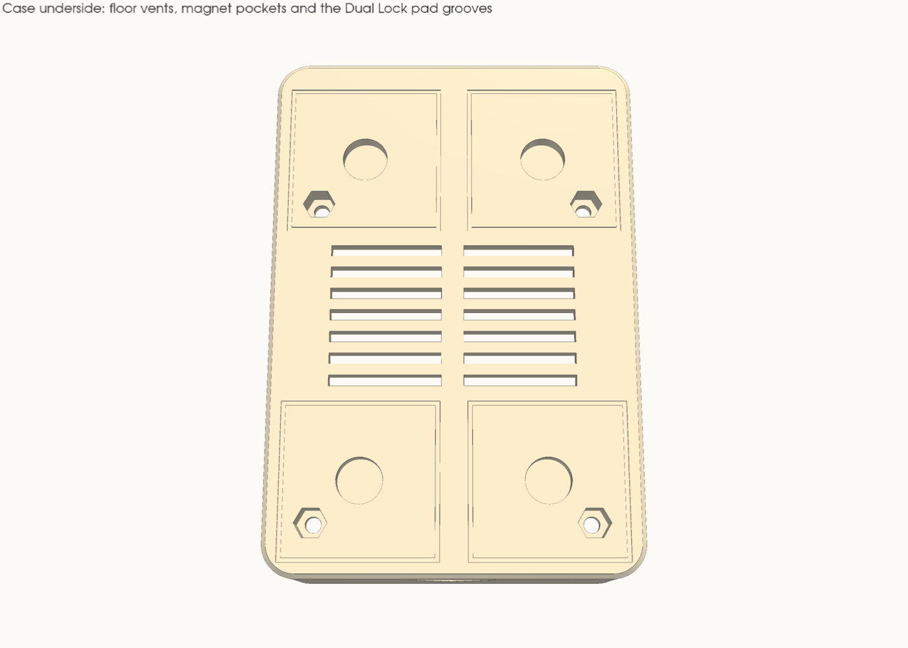

# Enclosure report

Generated by `kit.py` on 2026-10-07 for **usb_side = right**, **pi_model = 4**. Don't edit it by hand: change a parameter in `kit.py` and run `make`.

## Summary

- **Clearances:** 39 checked, none under its minimum. The tightest against its minimum is *Pi placeholder → case (less the Pi's own bosses)* at 0.50 mm (needs 0.50).
- **Printability:** no bridge over 20 mm, and no sloping overhang past 45°, across the case, lid, spacers and fit test.
- **Unmeasured:** 12 dimensions are still published or guessed. Rows that depend on one say so; see *Measurements still needed*.
- **Size:** the case is 66.30 × 95.40 mm, 26.80 mm to the lid's top and 29.20 mm to the fader caps. It sits on the Solo's right end on 5.7 mm of Dual Lock; about 83 mm tall all together.

| Case from above, lid off | Case from the rear right |
|---|---|
|  |  |

| Rear | Right side |
|---|---|
|  |  |

| Lid from above | Close up |
|---|---|
|  |  |

| Exploded | Underside |
|---|---|
|  |  |

## Clearances

All in mm. A row passes at or above its minimum (0.50 unless it says otherwise). Plan-view rows treat the Pi as a column, because it drops in from above. Rows marked *by design* restate a parameter; they're listed so nothing is hidden.

### The Pi to the walls

| Check | Clearance | Minimum | Status | Note |
|---|---:|---:|---|---|
| front wall ← SD card | 0.50 | 0.50 | ok (unmeasured) | unmeasured: Pi connector overhangs |
| left wall ← board | 3.00 | 0.50 | ok (unmeasured) | unmeasured: Pi connector overhangs |
| right wall ← audio | 0.50 | 0.50 | ok (unmeasured) | unmeasured: Pi connector overhangs; the edge connector that reaches furthest, by design (`port_gap`) |
| rear wall (inside face) ← board | 2.10 | 0.50 | ok (unmeasured) | unmeasured: Pi connector overhangs |
| USB-A/Ethernet faces → rear wall's outside face | 0.50 | 0.50 | ok (unmeasured) | unmeasured: Pi connector overhangs; by design (`rear_jack_proud`): the jacks reach into the open notch |

### The Pi, spacers and screws

| Check | Clearance | Minimum | Status | Note |
|---|---:|---:|---|---|
| spacer tube → nearest part on the board (USB-C power) | 0.62 | 0.50 | ok (unmeasured) | unmeasured: Pi connector overhangs |
| spacer tube → nearest wall | 3.25 | 0.50 | ok |  |
| M2.5 × 25: full thread in the nut, worst case | 1.53 | 1.00 | ok | nut is 2; 1.0 mm is about 2 threads, plenty for a lid clamp; nominal tip 1.00 past the nut |
| screw tip → the case's underside, worst case (it stays inside the pocket) | 0.63 | 0.50 | ok |  |
| plastic round the nut pocket's corners | 0.81 | 0.80 | ok |  |
| plastic between the nut and the board (squeezed by the clamp) | 1.60 | 1.20 | ok |  |
| each nut pocket sits under a Dual Lock square (which keeps the nut in) | 1.00 | 0.00 | ok |  |
| magnet pocket roof (inside the case) | 0.60 | 0.40 | ok |  |
| magnet bump top → the board's underside parts | 1.20 | 0.50 | ok |  |

### The Pi, up and down

| Check | Clearance | Minimum | Status | Note |
|---|---:|---:|---|---|
| tallest jack top → lid underside | 1.70 | 0.50 | ok |  |
| heatsink top → lid underside (spec: 5 mm for airflow) | 8.20 | 5.00 | ok |  |
| board underside parts → floor | 2.50 | 0.50 | ok |  |

### Port faces to openings

| Check | Clearance | Minimum | Status | Note |
|---|---:|---:|---|---|
| USB-C receptacle → window sides | 2.18 | 0.50 | ok (unmeasured) | unmeasured: Pi connector overhangs |
| USB-C receptacle → window bottom | 2.40 | 0.50 | ok |  |
| USB-C plug body → window sides | 1.00 | 0.50 | ok (unmeasured) | unmeasured: pwr_plug_w |
| USB-C plug body → window bottom/top | 0.75 | 0.50 | ok (unmeasured) | unmeasured: pwr_plug_h |
| USB 2 jack → notch sides | 4.15 | 0.50 | ok (unmeasured) | unmeasured: Pi connector overhangs |
| USB 3 jack → notch sides | 21.25 | 0.50 | ok (unmeasured) | unmeasured: Pi connector overhangs |
| Ethernet jack → notch sides | 1.99 | 0.50 | ok (unmeasured) | unmeasured: Pi connector overhangs |
| jack bottoms → notch floor | 2.50 | 0.50 | ok | by design (`notch_floor_drop`) |
| lower USB-A plug body → notch floor | 2.70 | 0.50 | ok (unmeasured) | unmeasured: usb_low_port_zc, usb_plug_h |
| USB-A plug body → notch side (outer stack) | 3.50 | 0.50 | ok (unmeasured) | unmeasured: usb_plug_w |
| SD card → slot sides | 2.00 | 0.50 | ok (unmeasured) | unmeasured: Pi connector overhangs |
| SD card → slot bottom | 1.60 | 0.50 | ok |  |

### On the Solo

| Check | Clearance | Minimum | Status | Note |
|---|---:|---:|---|---|
| case front face → Solo front face (the case mustn't overhang the controls) | 0.60 | 0.00 | ok (unmeasured) | unmeasured: solo_w, solo_d |
| Dual Lock pads → edge of the Solo's top | 4.00 | 0.00 | ok (unmeasured) | unmeasured: solo_w, solo_d |
| USB cable slack (cable less plug bodies, less the run between them) | 32.00 | 0.00 | ok (unmeasured) | unmeasured: solo_usb_x, solo_usb_z |

### Lid

| Check | Clearance | Minimum | Status | Note |
|---|---:|---:|---|---|
| wall tops → lid underside (the lid clamps on the spacers, not the walls) | 0.40 | 0.20 | ok |  |
| screw countersink → lid edge | 5.90 | 0.50 | ok |  |
| screw countersink → nearest opening or engraving in the lid (cassette window) | 2.00 | 0.50 | ok |  |

### Cross-check (OCC solid distance)

| Check | Clearance | Minimum | Status | Note |
|---|---:|---:|---|---|
| Pi placeholder → case (less the Pi's own bosses) | 0.50 | 0.50 | ok (unmeasured) | unmeasured: Pi connector overhangs |
| Pi placeholder → lid | 1.70 | 0.50 | ok |  |
| spacers → case (less the Pi's own bosses) | 3.25 | 0.50 | ok |  |
| Solo body → case (the Dual Lock gap) | 5.70 | 0.50 | ok (unmeasured) | unmeasured: solo_w, solo_d |

## Printability

Checked on the exported STLs in print orientation. Every downward-facing triangle steeper than 45° (plus 1° for the facets of curved 45° surfaces) from vertical, other than the bed face, is grouped into regions. A region at 90° is a flat ceiling, so a bridge. Its span is twice the furthest any point of it lies from a *supported* edge, one with material running down from it: a slot in a wall counts its full length, a pocket roof its width. `tests.py` checks this against shapes that should fail.

| Part | Orientation | Size (mm) | Watertight | Bodies | Ceiling regions | Longest bridge | Overhangs past 45° |
|---|---|---|---|---:|---:|---:|---|
| case | floor down | 66.3 × 95.4 × 24.0 | yes | 1 | 12 | 8.12 mm | none |
| lid | top up (as fitted) | 66.3 × 95.4 × 4.8 | yes | 1 | 4 | 2.40 mm | none |
| spacers | standing up | 34.0 × 5.5 × 16.7 | yes | 4 | 0 | 0.00 mm | none |
| fit_test_pi | plate down | 69.5 × 60.5 × 6.4 | yes | 5 | 4 | 2.59 mm | none |

**case** ceiling regions (all under 20 mm):

| Bridge span | Footprint | Height | Area (mm²) |
|---:|---|---:|---:|
| 8.12 | 8.2 × 8.2 | 3.10 | 52.8 |
| 8.08 | 8.2 × 8.2 | 3.10 | 52.8 |
| 8.07 | 8.2 × 8.2 | 3.10 | 52.8 |
| 8.07 | 8.2 × 8.2 | 3.10 | 52.8 |
| 2.59 | 5.9 × 5.1 | 4.80 | 15.9 |
| 2.59 | 5.9 × 5.1 | 4.80 | 15.9 |
| 2.59 | 5.9 × 5.1 | 4.80 | 15.9 |
| 2.59 | 5.9 × 5.1 | 4.80 | 15.9 |
| 0.81 | 28.0 × 28.0 | 0.40 | 87.0 |
| 0.81 | 28.0 × 28.0 | 0.40 | 87.0 |
| 0.81 | 28.0 × 28.0 | 0.40 | 87.0 |
| 0.81 | 28.0 × 28.0 | 0.40 | 87.0 |

**lid** ceiling regions (all under 20 mm):

| Bridge span | Footprint | Height | Area (mm²) |
|---:|---|---:|---:|
| 2.40 | 2.4 × 4.0 | 2.41 | 9.6 |
| 2.40 | 2.4 × 4.0 | 2.41 | 9.6 |
| 2.40 | 2.4 × 4.0 | 2.41 | 9.6 |
| 2.40 | 2.4 × 4.0 | 2.41 | 9.6 |

**fit_test_pi** ceiling regions (all under 20 mm):

| Bridge span | Footprint | Height | Area (mm²) |
|---:|---|---:|---:|
| 2.59 | 5.9 × 5.1 | 4.80 | 15.9 |
| 2.59 | 5.9 × 5.1 | 4.80 | 15.9 |
| 2.59 | 5.9 × 5.1 | 4.80 | 15.9 |
| 2.59 | 5.9 × 5.1 | 4.80 | 15.9 |

Where they come from: the magnet pockets on the case's underside have 8.20 mm roofs; each nut pocket's roof bridges about 5.89 mm (the hex, opening on the bed face); the Dual Lock locating grooves are 0.40 mm-deep channels on the bed face, so their roofs bridge 0.80 mm; on the lid, each fader cap bridges its 2.40 mm slot. Everything else is a wall, a peaked top, the open-topped rear notch, a through-slot, a 45° chamfer, or something standing up from the lid's top face. **No part needs supports.**

## Departures from the spec

1. **The case rides on top of the Solo** (Gabe's call, 2026-10-07). The spec's tray-under-the-Solo is gone: the
   Solo is the heavier part (382 g against about 100 g), so it sits on its own feet and the Pi rides on top like a
   backpack. That retires the spec's tray, lid pocket, corner posts, the Solo fit test and the accessory points, and
   the Solo dimensions only place the case now. The Pi's heat rises away from the Solo instead of into it.
2. **Dual Lock now, a clip saddle later.** Four 1" 3M Dual Lock squares hold the case on. A clip-on saddle that hooks
   the Solo's bare left and right ends can come once the Solo is here; it will carry the same pads, so the case
   doesn't change. The pads sit in outline grooves rather than recesses: a 25 mm recess roof would be a bridge over
   20 mm.
3. **The Pi's rotation.** The spec places the board with the SD end left, USB end right and power/HDMI edge at the
   rear. No Pi can sit that way: the board is chiral, and with the SD end on the left its power edge is at the
   **front** (official mechanical drawing, RP-008343). The case lies the board front to back: **USB-A and Ethernet
   face the rear**, through an open-topped notch, so the cable drops straight down to the Solo's rear USB-C;
   **power comes in through a peaked window in the right wall**. `usb_side` now only picks which end of the Solo's
   top the case sits on.
4. **The power-edge gap uses the audio jack.** On the Pi 4 the audio barrel stands 2.5 mm proud of the board edge,
   further than the USB-C (1.25). The model keeps `port_gap` from whichever connector on that edge reaches furthest
   (2.00 mm for this build).
5. **The rear jacks reach into the notch.** Their faces stop 0.5 mm inside the rear wall's
   *outside* face, so plugs seat fully and the case stays shallower than the Solo. The notch floor is
   2.50 mm below the board top so the lower plug's body clears it, and the notch runs to the right wall.
6. **Hardware on hand, not heat-set inserts.** One M2.5 × 25 screw per corner runs through the lid, a
   printed 16.7 mm spacer tube, the Pi's hole and the boss into a nut pressed up into a hex pocket from
   the case's underside. Tightening pulls the nut up while the board pushes down, squeezing the 1.6 mm of
   plastic between them, so lid, spacer, Pi and case clamp together; there's no room for separate lid bosses in a
   case this tight. (A first try slid the nuts into side slots: the slot walls came out too thin and the roof
   popped when a nut went in. Pockets from below have neither problem, and the Dual Lock squares cover them.)
   The bosses are 4 mm tall, not 5, so a 25 mm screw reaches through the nut, and 7.5 mm
   across with a 45° top chamfer, so they hold the nut and bear only on the Pi's 6 mm mounting pad. The wall tops stop 0.40 mm short of the lid, so the lid clamps on the
   spacers and can't rock or bow. The lid is 2.4 mm, not 3.0, so its heights fall on 0.2 mm layers.
   Four D8×3 magnets sit in pockets in the floor, one under each Dual Lock square, ready for the clip saddle.
7. **Vents in the lid and floor** as well as the left wall: the floor slots draw air through the Dual Lock gap, and
   the lid's openings let it out the top. The side vents are vertical slots with 45° peaked tops, not the
   spec's horizontal ones, which would bridge 40 mm.
8. **An SD-card slot** in the front wall, so the card comes out without opening the case.
9. **The fit-test plate** is bigger than 60 × 52: four 7.5 mm bosses on a 58 × 49 pattern need about
   69 × 60. It tests the nut pockets and the hole pattern.
10. **The look** (Gabe's ask, 2026-10-07): rounded corners and a rounded lid edge, and with
    `lid_style = "portastudio"` the lid is a cassette 4-track's top panel. Four fader slots (they vent the lid) with scales, caps and channel numbers; four knobs; transport keys (rewind, play, stop, fast-forward,
    record); and a recessed cassette window whose two reel hubs and tape window vent too, with the wordmark on its
    label. It all stands up from, or cuts into, the lid's top face, so it prints without supports.
    `lid_style = "plain"` gives a flat lid with vent slots and the wordmark.
11. **No official Pi 4 STEP exists.** Raspberry Pi publishes STEP models for the Pi 5 only. `assembly.step` carries
    a board-plus-ports placeholder built from the official Pi 4 drawing and DXF.

## Measurements still needed

Each is a one-line change in `kit.py`: replace the `est(...)` with the measured number and run `make`.

| Parameter | Current | Where it comes from |
|---|---:|---|
| `solo_w` | 143 | Focusrite: overall width |
| `solo_d` | 96 | Focusrite: overall depth |
| `solo_h` | 46.5 | Focusrite: overall height |
| `solo_foot_h` | 2 | guess: height of the bottom feet |
| `solo_usb_x` | 118 | guess: rear USB-C centre from the left end, seen from the front |
| `solo_usb_z` | 23 | guess: rear USB-C centre above the bottom of the body |
| `pi_hdmi_overhang` | 1.43 | drawing: micro-HDMI body starts at Y -1.43 |
| `pwr_plug_w` | 11 | guess: official 15 W supply's USB-C plug body width |
| `pwr_plug_h` | 6.5 | guess: its height |
| `usb_plug_w` | 16 | guess: a USB-A plug body's width, for the notch edges |
| `usb_plug_h` | 8 | guess: a USB-A plug body's height |
| `usb_low_port_zc` | 4.2 | guess: the lower USB-A port's centre above the board top |

## Hardware

| Qty | Part | Used for | Notes |
|---:|---|---|---|
| 4 | M2.5 × 25 mm countersunk (flat-head) screw | Lid, spacer, Pi and case, down into the nut | A pan head works with a washer under it; without one it bears on the countersink's edge |
| 4 | M2.5 nut (5 mm across the flats, 2 mm thick) | Pressed up into the hex pocket under each boss | A snug fit; the Dual Lock square over it keeps it in |
| 4 | Any short M2.5 screw (8–12 mm) | The fit test, optional | Or use the 25 mm ones with the spacers and the fit test's lid rings |
| 4 | Printed spacer tube, 5.5 mm × 16.7 mm (`out/spacers.stl`) | Between the board and the lid | Round, so nothing turns toward the USB-C |
| 4 | D8×3 mm magnet | Floor pockets, for the clip saddle later | All four with the same pole facing down; a drop of glue |
| 4 | 3M Dual Lock square, 1" (25.4 mm), SJ3550 or SJ3560 | Case to the Solo's top, until the saddle | Sticks straight over the magnets |
| 1 | USB-A to USB-C cable, 15–20 cm, a right-angle A end if you can | Pi to Solo | Out of the rear notch and straight down to the Solo's rear USB-C |
| 1 | Official Pi 4 15 W USB-C supply | Power | Through the right-wall window; see the spec's *Power and RAM* |
| 1 | Pi 4 heatsink under 10 mm tall | SoC | `pi_heatsink_top` is its top above the board |
| — | PETG | Case, lid, spacers, fit test | Under 60 g (that's if solid; infill uses less). Not PLA |

Spares worth having: a couple of extra nuts; they're small and they roll.

