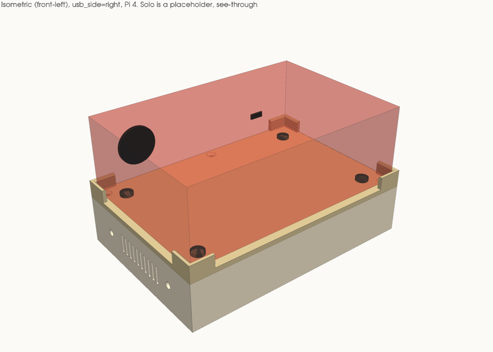
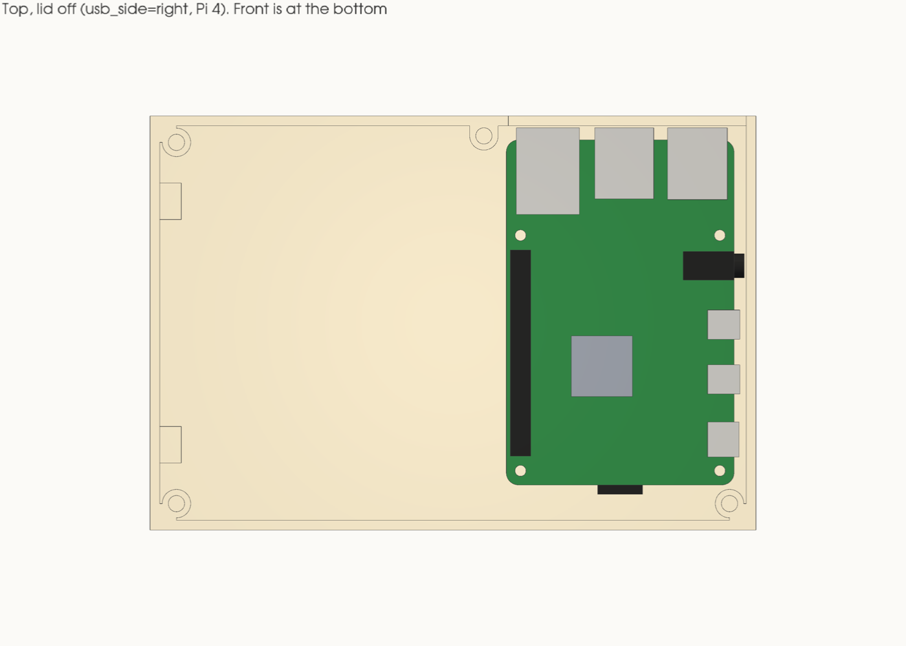
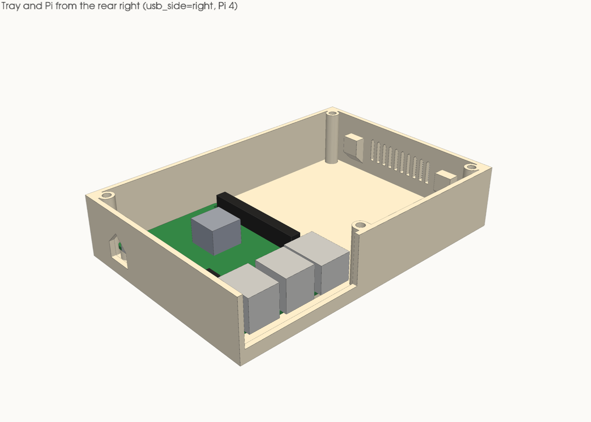
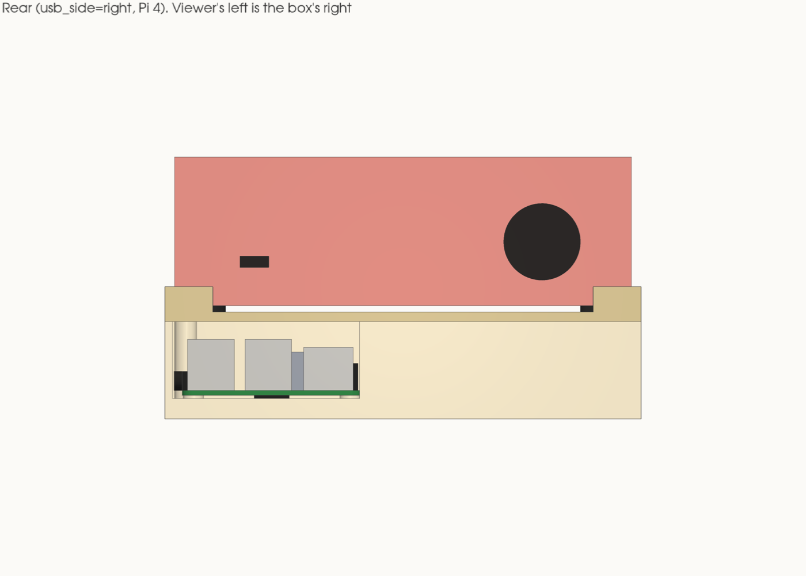
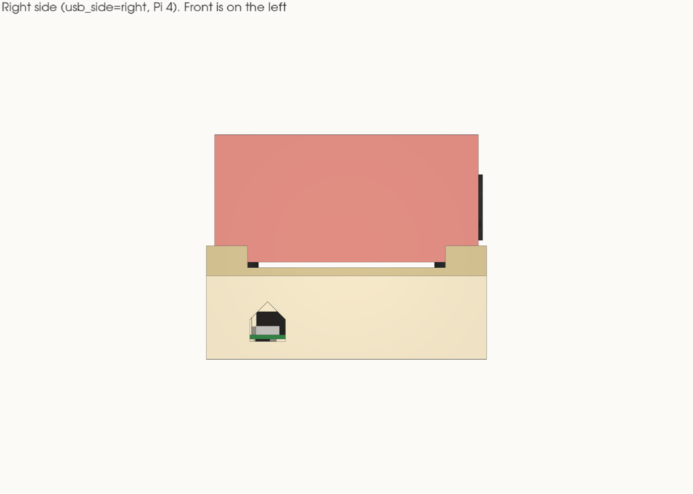
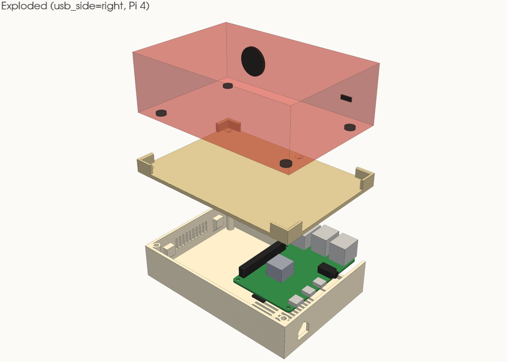
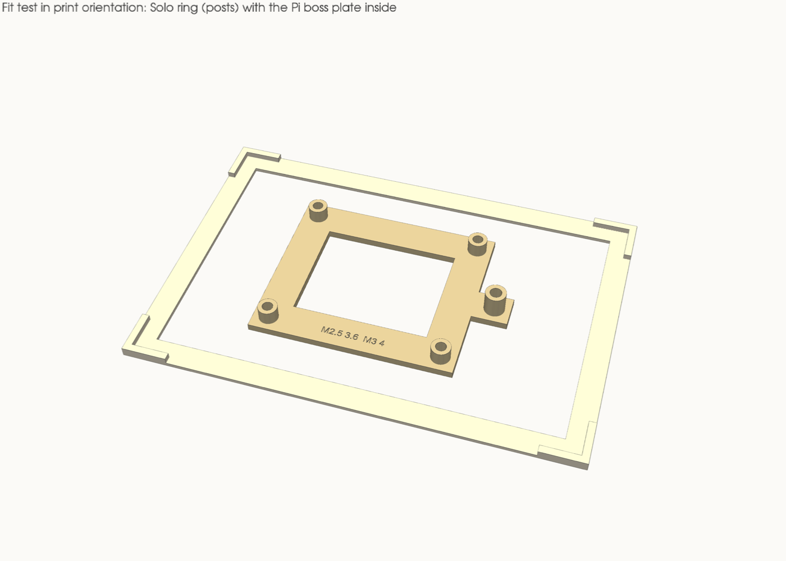

# Enclosure report

Generated by `kit.py` on 2026-10-07 for **usb_side = right**, **pi_model = 4**. Don't edit it by hand: change a parameter in `kit.py` and run `make`.

## Summary

- **Clearances:** 37 checked, none under its minimum. The tightest against its minimum is *rear wall ← USB 2* at 0.50 mm (needs 0.50).
- **Printability:** no bridge over 20 mm, and no sloping overhang past 45°, across the tray, lid and both fit-test halves.
- **Unmeasured:** 21 dimensions are still published or guessed. Rows that depend on one say so; see *Measurements still needed*.
- **Size:** 149.00 × 102.00 mm footprint; base 33.40 mm tall without feet; about 82 mm with the Solo on top.

| Top, lid off | Tray from the rear right |
|---|---|
|  |  |

| Rear | Right side |
|---|---|
|  |  |

| Exploded | Fit test |
|---|---|
|  |  |

## Clearances

All in mm. A row passes at or above its minimum (0.50 unless it says otherwise). Plan-view rows treat the Pi as a column, because it drops in from above.

### The Pi to the walls

| Check | Clearance | Minimum | Status | Note |
|---|---:|---:|---|---|
| front wall ← SD card | 6.40 | 0.50 | ok (unmeasured) | unmeasured: Pi connector overhangs |
| rear wall ← USB 2 | 0.50 | 0.50 | ok (unmeasured) | unmeasured: Pi connector overhangs; jack faces, by design (port_gap); plugs go in through the notch |
| left wall ← board | 85.20 | 0.50 | ok (unmeasured) | unmeasured: Pi connector overhangs |
| right wall ← audio | 0.50 | 0.50 | ok (unmeasured) | unmeasured: Pi connector overhangs; the edge connector that reaches furthest, by design (port_gap) |

### The Pi to the bosses

| Check | Clearance | Minimum | Status | Note |
|---|---:|---:|---|---|
| lid boss, front-left | 77.73 | 0.50 | ok (unmeasured) | unmeasured: Pi connector overhangs |
| lid boss, front-right | 1.10 | 0.50 | ok (unmeasured) | unmeasured: Pi connector overhangs |
| lid boss, rear-left | 77.60 | 0.50 | ok (unmeasured) | unmeasured: Pi connector overhangs |
| lid boss, rear wall, X 79.7 | 2.09 | 0.50 | ok (unmeasured) | unmeasured: Pi connector overhangs |
| accessory pad, left wall at Y 18.6 | 79.90 | 0.50 | ok (unmeasured) | unmeasured: Pi connector overhangs |
| accessory pad, left wall at Y 78.6 | 79.90 | 0.50 | ok (unmeasured) | unmeasured: Pi connector overhangs |

### The Pi, up and down

| Check | Clearance | Minimum | Status | Note |
|---|---:|---:|---|---|
| tallest jack top → lid underside | 5.50 | 0.50 | ok (unmeasured) | unmeasured: pi_tallest |
| heatsink top → lid underside (spec: 5 mm for airflow) | 9.50 | 5.00 | ok (unmeasured) | unmeasured: pi_heatsink_top |
| board underside parts → floor | 3.50 | 0.50 | ok |  |

### Port faces to openings

| Check | Clearance | Minimum | Status | Note |
|---|---:|---:|---|---|
| USB-C receptacle → window sides | 2.18 | 0.50 | ok (unmeasured) | unmeasured: Pi connector overhangs |
| USB-C receptacle → window bottom | 2.40 | 0.50 | ok |  |
| USB-C plug body → window sides | 1.00 | 0.50 | ok (unmeasured) | unmeasured: pwr_plug_w |
| USB-C plug body → window bottom/top | 0.75 | 0.50 | ok (unmeasured) | unmeasured: pwr_plug_h |
| USB 2 jack → notch sides | 4.65 | 0.50 | ok (unmeasured) | unmeasured: Pi connector overhangs |
| USB 3 jack → notch sides | 21.25 | 0.50 | ok (unmeasured) | unmeasured: Pi connector overhangs |
| Ethernet jack → notch sides | 1.99 | 0.50 | ok (unmeasured) | unmeasured: Pi connector overhangs |
| jack bottoms → notch floor | 2.50 | 0.50 | ok | `notch_floor_drop`, by design |
| lower USB-A plug body → notch floor | 2.70 | 0.50 | ok (unmeasured) | unmeasured: usb_low_port_zc, usb_plug_h |
| USB-A plug body → notch side (outer stack) | 4.00 | 0.50 | ok (unmeasured) | unmeasured: usb_plug_w |

### The Solo and the posts

| Check | Clearance | Minimum | Status | Note |
|---|---:|---:|---|---|
| Solo body → post inside faces | 0.60 | 0.50 | ok (unmeasured) | `fit`, by design; unmeasured: solo_w, solo_d |
| post top → lowest XLR or front jack/knob, less 2 (spec) | 0.00 | 0.00 | ok (unmeasured) | unmeasured: solo_xlr_z, solo_front_low_z |
| Solo USB-C plug → rear-right post leg (sideways) | 7.00 | 0.50 | ok (unmeasured) | unmeasured: solo_usb_x, solo_usb_plug_w |

### Lid screws

| Check | Clearance | Minimum | Status | Note |
|---|---:|---:|---|---|
| countersink, front-left → nearest post | 0.90 | 0.50 | ok |  |
| countersink, front-left → lid edge | 3.30 | 0.50 | ok |  |
| countersink, front-right → nearest post | 0.90 | 0.50 | ok |  |
| countersink, front-right → lid edge | 3.30 | 0.50 | ok |  |
| countersink, rear-left → nearest post | 0.90 | 0.50 | ok |  |
| countersink, rear-left → lid edge | 3.30 | 0.50 | ok |  |
| countersink, rear wall, X 79.7 → nearest post | 48.76 | 0.50 | ok |  |
| countersink, rear wall, X 79.7 → lid edge | 1.70 | 0.50 | ok |  |

### Cross-check (OCC solid distance)

| Check | Clearance | Minimum | Status | Note |
|---|---:|---:|---|---|
| Pi placeholder → tray (less the Pi's own bosses) | 0.50 | 0.50 | ok (unmeasured) | unmeasured: Pi connector overhangs |
| Pi placeholder → lid | 5.50 | 0.50 | ok |  |
| Solo body → lid posts | 0.60 | 0.50 | ok (unmeasured) | unmeasured: solo_w, solo_d |

## Printability

Checked on the exported STLs in print orientation. Every downward-facing triangle steeper than 45° from vertical, other than the bed face, is grouped into regions. A region at 90° is a flat ceiling, so a bridge. Its span is twice the furthest any point of it lies from a *supported* edge, one with material running down from it: a slot in a wall counts its full length, a pocket roof its width. `tests.py` checks this against shapes that should fail.

| Part | Orientation | Size (mm) | Watertight | Bodies | Ceiling regions | Longest bridge | Overhangs past 45° |
|---|---|---|---|---:|---:|---:|---|
| tray | floor down | 149.0 × 102.0 × 30.4 | yes | 1 | 4 | 10.51 mm | none |
| lid | deck down, posts up | 149.0 × 102.0 × 11.0 | yes | 1 | 0 | 0.00 mm | none |
| fit_test_pi | plate down | 80.5 × 59.5 × 10.1 | yes | 1 | 0 | 0.00 mm | none |
| fit_test_solo | ring down | 149.0 × 102.0 × 3.2 | yes | 1 | 0 | 0.00 mm | none |

**tray** ceiling regions (all under 20 mm):

| Bridge span | Footprint | Height | Area (mm²) |
|---:|---|---:|---:|
| 10.51 | 10.6 × 10.6 | 1.00 | 88.2 |
| 10.51 | 10.6 × 10.6 | 1.00 | 88.2 |
| 10.50 | 10.6 × 10.6 | 1.00 | 88.2 |
| 10.50 | 10.6 × 10.6 | 1.00 | 88.2 |

Where they come from: the four foot recesses under the tray are 1 mm-deep pockets on the bed face, so their roofs bridge 10.60 mm. Everything else is a wall, a peaked top, an open-topped notch, a 45° pad underside, a teardrop bore or an upward-facing countersink. **No part needs supports.**

## Departures from the spec

1. **The Pi's rotation.** The spec's default layout puts the SD-card end on the left, the USB end on the right and
   the power/HDMI edge at the rear. No Pi can sit that way: the board is chiral. Seen from above with the SD end on
   the left, its power/HDMI edge is at the **front** (official mechanical drawing, RP-008343). So the model rotates
   the board instead of mirroring it:
   - `usb_side = right`: the board's long axis runs front to back against the right wall. **USB-A and Ethernet face
     the rear wall**, through an open-topped notch, so the cable to the Solo's rear USB-C is a short hop straight up.
     **USB-C power enters through a peaked window in the right wall.**
   - `usb_side = left`: the spec's layout mirrored, which is a real rotation. USB-A and Ethernet face the left wall,
     and power enters through the rear wall.

   This build: USB-A/Ethernet out of the **rear** wall, power in through the **right** wall, the window
   centred 19.90 mm along it from the cavity's inside corner.
2. **The power-edge gap uses the audio jack.** On the Pi 4 the audio barrel stands 2.5 mm proud of the board edge,
   further than the USB-C (1.25). The spec's board extent left 2.0 mm, which would push the barrel into the wall. The
   model keeps `port_gap` from whichever connector on that edge reaches furthest (2.50 mm for this build).
3. **Lid screws.** Corner screws sit 6.5 mm in from the outside edges, not tight in the corner,
   so their countersinks clear the Solo posts above them. The corner the Pi occupies is dropped, and a boss on the
   rear wall beside the Pi replaces it: rear wall, X 79.7.
4. **Post thickness** is `wall` (2.4 mm), not 3 mm. With the inside faces `fit` from the Solo, a 3 mm post
   would hang 0.60 mm past the 149 × 102 footprint.
5. **Side vents are vertical.** Three horizontal 2 × 40 mm slots would leave 40 mm bridges over their tops. The model
   uses 10 vertical 2 × 12 mm slots with 45° peaked tops across the same 40 mm, in the
   left wall, across the Pi from the power edge, for the spec's cross-flow.
6. **The fit-test plate** is bigger than 60 × 52: four 6.5 mm bosses on a 58 × 49 pattern need about 68 × 60. It
   also carries one M3 lid-insert boss on a tab, so you can practise that insert too. The Solo half is a thin ring
   with a 2 mm slice of each post on it.
7. **Accessory points.** Each insert sits in a pad inside the wall with a 45° underside and a teardrop bore, so it
   prints without support. Pads the Pi or a port opening would hit are left out: right wall at Y 18.6 (the Pi sits there), right wall at Y 78.6 (the Pi sits there). Nothing uses them yet.
8. **No official Pi 4 STEP exists.** Raspberry Pi publishes STEP models for the Pi 5 only. `assembly.step` carries
   a board-plus-ports placeholder built from the official Pi 4 drawing and DXF.
9. **The notch floor is lower and the notch runs into the corner.** The spec puts the notch floor 0.5 mm below the
   board top. The model drops it 2.50 mm, so a USB-A plug in the lower port clears it; and where the Pi
   took a corner from the lid screws, the notch runs on into that corner, so the outer plug has room sideways.
10. **No wordmark** on the front wall (optional in the spec). Engraving on a vertical face adds many small ceilings.

## Measurements still needed

Each is a one-line change in `kit.py`: replace the `est(...)` with the measured number and run `make`.

| Parameter | Current | Where it comes from |
|---|---:|---|
| `solo_w` | 143 | Focusrite: overall width |
| `solo_d` | 96 | Focusrite: overall depth |
| `solo_h` | 46.5 | Focusrite: overall height |
| `solo_foot_h` | 2 | guess: height of the bottom feet |
| `solo_usb_x` | 118 | guess: rear USB-C centre from the left end, seen from the front |
| `solo_xlr_z` | 10 | guess: XLR plug's lowest point above the deck |
| `solo_front_low_z` | 10 | guess: lowest front knob skirt or jack above the deck |
| `solo_usb_plug_w` | 12 | guess: width of the USB-C plug body going into the Solo |
| `pi_board_t` | 1.5 | spec: about 1.5 |
| `pi_usb_overhang` | 3 | drawing: USB-A and Ethernet reach 88.0 on the 85 board |
| `pi_usbc_overhang` | 1.25 | drawing: USB-C body starts at Y -1.25 |
| `pi_hdmi_overhang` | 1.43 | drawing: micro-HDMI body starts at Y -1.43 |
| `pi_audio_overhang` | 2.5 | drawing: audio barrel reaches Y -2.5 (Pi 4 only) |
| `pi_sd_protrude` | 2.3 | drawing: an inserted card reaches X -2.27 |
| `pi_tallest` | 16 | drawing: USB-A stack Z 16.0 |
| `pi_heatsink_top` | 12 | guess: an under-10 mm heatsink on the 2.4 mm SoC |
| `pwr_plug_w` | 11 | guess: official 15 W supply's USB-C plug body width |
| `pwr_plug_h` | 6.5 | guess: its height |
| `usb_plug_w` | 16 | guess: a USB-A plug body's width, for the notch edges |
| `usb_plug_h` | 8 | guess: a USB-A plug body's height |
| `usb_low_port_zc` | 4.2 | guess: the lower USB-A port's centre above the board top |

## Hardware

| Qty | Part | Used for | Notes |
|---:|---|---|---|
| 4 | M2.5 heat-set insert, 4 mm long | Pi bosses | Bore 3.6 mm, 5 mm deep. Check the maker's hole size |
| 4 | M2.5 × 6 mm screw, pan or cap head | Pi to bosses | Through the 1.5 mm board leaves 4.5 mm in the insert |
| 6 | M3 heat-set insert, 5.7 mm long | 4 lid bosses + 2 accessory points | Bore 4 mm, 6.7 mm deep |
| 4 | M3 × 8 mm countersunk screw (ISO 10642 / DIN 7991) | Lid to tray | Head sits flush in a 6.4 mm countersink; 5 mm in the insert |
| 4 | Adhesive rubber bumper, about 10 mm across | Feet | In 10.6 mm × 1 mm recesses |
| 1 | USB-A to USB-C cable, 15–20 cm, a right-angle A end if you can | Pi to Solo | Out of the rear notch, up to the Solo's rear USB-C |
| 1 | Official Pi 4 15 W USB-C supply | Power | Through the right-wall window; see the spec's *Power and RAM* |
| 1 | Pi 4 heatsink under 10 mm tall | SoC | `pi_heatsink_top` is its top above the board |
| — | PETG | All four prints | Under 162 g (that's if solid; 4 walls and 20% infill use less). Not PLA |

Spares worth having: two extra of each insert, for the fit test and a botched one. The fit test uses 4 × M2.5 and
1 × M3 insert of its own.

